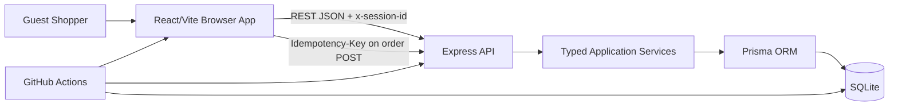

# Technical Design: Mobile Phone Shopping MVP

**Date:** 2026-08-28  
**Status:** Proposed design for implementation  
**Scope:** MVP `US-001` to `US-008`  
**Related plan:** [2026-08-28-MOBILE-PHONE-SHOPPING-MVP.md](../docs/development-plans/2026-08-28-MOBILE-PHONE-SHOPPING-MVP.md)

## 1. Purpose

This document defines the target technical design for the anonymous guest-shopping MVP. It is the implementation contract for converting the current JavaScript demo into a TypeScript npm-workspace monorepo with a server-backed React experience.

The system must support:

```text
Browse/search -> Product detail -> Cart -> Checkout -> COD order -> Confirmation
```

The server is authoritative for product availability, prices, cart totals, order totals, inventory, order status, order identifiers, and confirmation access.

## 2. Approved Design Decisions

| Area | Decision |
|---|---|
| Scope | Implement the complete guest journey from `US-001` through `US-008`. |
| Language | Remove JavaScript source/config files from the migration scope. Use TypeScript and TSX. Keep JSON, CSS, HTML, Prisma schema, and Markdown files where appropriate. |
| Repository | Use npm workspaces: `client`, `server`, and `shared`. |
| Frontend | React/Vite feature-first structure, consuming the REST API. Remove mock products and localStorage cart as sources of truth. |
| Backend | Layered Express application with routes/controllers, services, validators, repositories, middleware, and configuration. |
| Database | SQLite with Prisma. Reset and reseed demo data after schema changes. |
| Guest session | Client generates a UUID once per browser session, stores it in `sessionStorage`, and sends it as `x-session-id`. Missing/invalid session headers are rejected. |
| Idempotency | Client sends a UUID per checkout attempt in `Idempotency-Key`. The server persists it by session and replays the original order for an identical retry. |
| Payment | Cash on Delivery (`COD`) only. |
| Testing | Vitest, React Testing Library, and Playwright. |
| CI | GitHub Actions for type-check, lint, tests, E2E smoke, and builds. |
| Deployment | Local development and CI only; no staging or production deployment. |

## 3. System Context



### Components

| Component | Responsibility | Technology |
|---|---|---|
| Browser client | Product discovery, cart interaction, checkout form, review, confirmation rendering, session storage. | React 19, Vite, TypeScript |
| HTTP client | Typed requests, headers, response/error normalization, API base URL. | TypeScript `fetch` wrapper |
| API application | HTTP routing, request validation, session/idempotency middleware, error mapping. | Express 5, TypeScript, Zod |
| Domain services | Product search, cart rules, checkout validation, order transaction, confirmation authorization. | TypeScript |
| Persistence layer | Product/cart/order queries and transaction operations. | Prisma 6, SQLite |
| Shared package | Domain types, request/response contracts, error codes, status/payment literals. | TypeScript |
| Quality pipeline | Reproducible validation and isolated test execution. | GitHub Actions, Vitest, Playwright |

## 4. Repository and Module Design

### Target repository

```text
/
  package.json
  tsconfig.base.json
  client/
    package.json
    tsconfig.json
    vite.config.ts
    src/
      app/
      components/
        common/
        forms/
        layout/
      features/
        products/
          pages/
          components/
          hooks/
          services/
          types/
          index.ts
        cart/
        checkout/
        orders/
      services/
        api/
        storage/
      types/
      main.tsx
  server/
    package.json
    tsconfig.json
    prisma/
      schema.prisma
      seed.ts
    src/
      app.ts
      server.ts
      config/
      middleware/
      routes/
      controllers/
      services/
      repositories/
      validators/
      types/
  shared/
    package.json
    tsconfig.json
    src/
      api/
      domain/
      errors/
      index.ts
  tests/
    e2e/
    fixtures/
  .github/
    workflows/
      ci.yml
```

### Dependency direction

```text
client features -> client services -> shared contracts
server routes -> controllers -> domain services -> repositories -> Prisma
client/server -> shared
shared -> no client/server/Prisma implementation dependency
```

The shared package must not import Prisma-generated types. Server persistence types are mapped into shared API response types at the controller/service boundary.

## 5. Domain Model and Persistence Design

### Product

| Field | Type | Rules |
|---|---|---|
| `id` | integer | Internal identifier; never treated as a writable client field. |
| `name` | string | Unique product name. |
| `brand` | string | Searchable brand. |
| `description` | string | Product description. |
| `price` | number | Server-owned current unit price. |
| `stockQuantity` | integer | Must be non-negative. |
| `imageUrl` | string | Product image or deterministic fallback source. |
| `specifications` | string | Product specifications representation. |
| `isActive` | boolean | Only active products are browseable/searchable. |
| timestamps | datetime | Persistence metadata. |

### Cart and CartItem

- `Cart.sessionId` is unique and identifies one anonymous browser session.
- `CartItem` has a composite uniqueness constraint on `(cartId, productId)` to prevent duplicate lines.
- `CartItem.unitPrice` is a cart snapshot for display, but final order pricing is calculated from server-owned product prices according to the approved contract.
- Cart reads include product information needed for display, while write operations verify current product state and session ownership.

### Order and OrderItem

Add or preserve the following order fields:

| Field | Type | Rules |
|---|---|---|
| `orderNumber` | string | Unique opaque public identifier; never the sole authorization control. |
| `sessionId` | string | Required creating guest session identifier. |
| `idempotencyKey` | string | Required checkout replay key, unique with session scope. |
| customer/shipping fields | strings | Validated by the shared checkout contract. |
| `paymentMethod` | literal | Must be `COD`. |
| `status` | literal/string | New orders are `Pending`. |
| `totalAmount` | number | Calculated server-side. |

Each `OrderItem` stores `productName`, `unitPrice`, `quantity`, and `subtotal` snapshots. This keeps historical confirmations stable if a product later changes.

Recommended logical uniqueness:

```text
UNIQUE(sessionId, idempotencyKey)
UNIQUE(orderNumber)
UNIQUE(cartId, productId)
```

If the Prisma/SQLite provider requires a different representation for the composite replay key, the repository must still enforce the same logical constraint and handle race conflicts safely.

## 6. Shared TypeScript Contracts

The `shared` package should expose distinct input and output types.

### Domain literals

```text
PaymentMethod = "COD"
OrderStatus = "Pending"
```

### Request contracts

- `ProductSearchQuery`: optional trimmed search string.
- `AddCartItemRequest`: `productId`, positive integer `quantity`.
- `UpdateCartItemRequest`: positive integer `quantity`.
- `CreateOrderRequest`: customer name, phone, optional email/postal code, shipping address, city, and `paymentMethod: COD`.
- `SessionHeaders`: valid `x-session-id`.
- `IdempotencyHeaders`: valid `Idempotency-Key` for order creation.

Protected fields such as price, stock quantity, total amount, order status, order number, and inventory mutation are excluded from client input types.

### Response contracts

- `ProductSummary` and `ProductDetails`.
- `CartResponse` with server-calculated item subtotals and total.
- `OrderResponse` with order number, status, payment method, customer/shipping data, total, and item snapshots.
- `ApiError` with `{ error: { code, message, fields? } }`.

## 7. API Design

### Common headers

| Header | Required | Description |
|---|---:|---|
| `x-session-id` | Cart/order endpoints | UUID identifying the anonymous guest session. |
| `Idempotency-Key` | `POST /api/orders` | UUID identifying one checkout attempt. |
| `Content-Type` | JSON requests | `application/json`. |

### Endpoints

| Method | Endpoint | Behavior | Success |
|---|---|---|---|
| `GET` | `/api/products?search=` | Return active products; trim search; case-insensitive partial match on name OR brand. | `200` |
| `GET` | `/api/products/:id` | Return one active product detail. Unknown product is generic not-found. | `200` |
| `GET` | `/api/cart` | Return the cart for `x-session-id`, creating an empty cart if appropriate. | `200` |
| `POST` | `/api/cart/items` | Add/increase a line after current stock validation. Reject overflow without mutation. | `201` |
| `PUT` | `/api/cart/items/:id` | Update an item owned by the session, within current stock. | `200` |
| `DELETE` | `/api/cart/items/:id` | Remove an item owned by the session. | `204` |
| `POST` | `/api/orders` | Validate, create, decrement stock, clear cart, and persist replay identity atomically. | `201` or replay response |
| `GET` | `/api/orders/:orderNumber` | Return confirmation only if order belongs to the same session. | `200` |

### Error mapping

| Condition | HTTP | Error code example |
|---|---:|---|
| Malformed JSON, invalid input, missing required header | `400` | `VALIDATION_ERROR` / `SESSION_REQUIRED` |
| Unknown product, cart item, or unauthorized order lookup | `404` | `RESOURCE_NOT_FOUND` |
| Stock changed, quantity overflow, idempotency conflict | `409` | `STOCK_CONFLICT` / `IDEMPOTENCY_CONFLICT` |
| Unexpected server failure | `500` | `INTERNAL_ERROR` |

All errors use the shared envelope. Unexpected errors are logged server-side without exposing stack traces, SQL, secrets, or unnecessary personal data to the client.

## 8. Session and Idempotency Flow

### Session lifecycle

1. On client startup, read `phone-market-session-id` from `sessionStorage`.
2. If absent, generate a UUID with `crypto.randomUUID()` and store it.
3. Attach `x-session-id` to cart and order requests.
4. Do not use `demo-session` or another shared fallback.
5. The API validates format and rejects missing/invalid session headers.

The storage key name is an implementation detail, but it must remain stable within the client and be documented for test fixtures.

### Order retry lifecycle

1. On entering a new Place Order attempt, generate a UUID idempotency key.
2. Send it as `Idempotency-Key` on `POST /api/orders`.
3. The server checks `(sessionId, idempotencyKey)` before creating a new order.
4. If a matching successful order exists, return the original order representation.
5. If the same key is reused with a materially different request, return `409 IDEMPOTENCY_CONFLICT` and do not mutate data.
6. A new checkout attempt receives a new key.

## 9. Order Transaction Design

The order service must execute the following logical operations inside one Prisma transaction:

```text
BEGIN
  validate/retrieve session cart
  if cart is empty -> fail 400, no writes
  check existing (sessionId, idempotencyKey)
    if same completed request -> return original order
    if conflicting request -> fail 409, no writes
  retrieve current product rows for every cart line
  validate active products and current stock
    if any failure -> fail 409, rollback
  calculate each subtotal and total from server-owned values
  generate opaque order number with collision retry
  create Order with Pending status and session/idempotency identity
  create OrderItem snapshots
  decrement inventory for every line
  clear all items from this session cart
COMMIT
return order confirmation payload
```

The implementation must guard against concurrent stock updates. A stock update must not allow a product to become negative. Database constraint errors and transaction conflicts must be mapped to safe API errors and tested for retry behavior.

## 10. Frontend State and Data Flow

The frontend should keep view state local to features and use server responses for business state.

```text
Products feature -> GET products/detail -> render server product
Cart feature -> GET/POST/PUT/DELETE cart -> render server cart
Checkout feature -> local form draft -> validate/display -> review
Order submit -> POST orders + headers -> store returned order number
Confirmation -> GET order with session header -> render server order
```

Required UI states:

- Product loading, empty search, unavailable product, unknown detail.
- Cart loading, empty cart, stock conflict, mutation error, retry.
- Checkout required/optional/invalid field errors, stale cart, empty cart.
- Order submit loading, duplicate-submit protection, validation/stock/API errors.
- Confirmation success, unknown order, unauthorized session, retryable API error.

The browser may keep a temporary form draft in React state, but it must not calculate or persist authoritative stock, price, total, status, or order number. Remove the current mock product array and localStorage cart behavior.

## 11. Validation and Security Controls

- Validate all request bodies, query parameters, path IDs, and required headers with Zod at the API boundary.
- Trim required text fields and reject whitespace-only values.
- Enforce checkout length/format rules from `DEC-03`.
- Accept only `COD`.
- Never trust client-provided price, stock, subtotal, total, status, or order number.
- Verify cart-item ownership through the session's cart before update/delete.
- Verify order ownership through `sessionId` before confirmation retrieval.
- Return generic not-found responses for unknown and cross-session orders.
- Use Prisma parameterized access; do not build SQL from request strings.
- Avoid logging full customer addresses, phone numbers, email, session IDs, or idempotency keys unless required for controlled diagnostics.
- Configure CORS and API base URLs explicitly for local development and CI.

## 12. Testing Design

### Test levels

| Level | Focus |
|---|---|
| Unit | Currency/total calculations, search normalization, checkout validation, order-number generation, idempotency comparison. |
| Component | Product list/detail, cart controls, checkout fields, error states, COD display, confirmation. |
| Integration | Prisma schema, reset/seed, repository ownership queries, transaction rollback, order snapshots. |
| API | Status codes, headers, error envelope, validation, business rules, privacy, tampering, idempotency. |
| E2E | Critical browse-to-confirmation journey and selected high-risk browser flows. |
| Accessibility | Keyboard navigation, visible focus, labels, field errors, accessible names, logical order. |
| Performance | Five concurrent users; p95 <= 2 seconds and error rate < 1% for the defined API journeys. |

Tests map to the approved 32 cases in `TC-FEATURE-Mobile-Phone-Shopping.md`. Database-backed tests use a dedicated SQLite database, deterministic reset/seed, unique sessions, and unique idempotency keys.

## 13. CI Design

GitHub Actions workflow: `.github/workflows/ci.yml`.

```text
checkout
  -> npm ci
  -> type-check shared/client/server
  -> lint
  -> reset + seed test database
  -> unit/component tests
  -> integration/API tests
  -> start server/client
  -> Playwright smoke tests
  -> client/server production builds
  -> upload test reports on failure
```

CI must not use the developer's database, localStorage, browser profile, or environment secrets. The workflow is a quality gate and does not deploy to staging or production.

## 14. Observability and Failure Handling

For local and CI diagnostics, include:

- Request method/path and status in server logs.
- A generated request/correlation ID for error diagnosis where practical.
- Duration measurements for performance tests.
- Safe error code and validation field names.
- Playwright traces/screenshots on failure.

Do not include raw checkout payloads or sensitive customer fields in default logs.

## 15. Technical Risks and Trade-offs

| Risk / trade-off | Impact | Design response |
|---|---|---|
| SQLite concurrency differs from production databases. | Performance/concurrency evidence is limited. | Keep the five-user performance gate explicitly local and document the limitation. |
| Shared package introduces workspace resolution complexity. | Clean install/build may fail if package exports are inconsistent. | Validate package exports from both client and server in CI. |
| Full TypeScript migration increases first implementation cost. | More setup and compile errors before feature work. | Migrate in dependency order: shared -> server contracts -> client contracts -> tests. |
| `sessionStorage` is browser-session scoped. | Cart does not persist across browser sessions/devices. | Keep this behavior explicit; no account or cross-device cart is in MVP. |
| Idempotency replay with conflicting payload needs deterministic comparison. | Incorrect conflict handling could create ambiguity. | Persist a normalized request fingerprint or equivalent server-side comparison data and test same-key conflict. |
| External product images may fail. | Visual tests can become unstable. | Use deterministic fallback rendering and avoid asserting third-party image timing. |

## 16. Implementation Readiness Checklist

- [ ] Root npm workspaces and TypeScript configs are defined.
- [ ] Shared package exports compile for both consumers.
- [ ] Prisma schema includes order `sessionId`, idempotency identity, unique order number, and item snapshots.
- [ ] Test reset/seed is deterministic and isolated.
- [ ] API error envelope and header contracts are implemented.
- [ ] Product, cart, checkout, order, session, and idempotency services have clear owners.
- [ ] Client no longer relies on mock products or localStorage cart.
- [ ] Critical transaction and privacy tests exist before E2E handoff.
- [ ] GitHub Actions runs all approved quality gates.
- [ ] Technical design, requirements, user stories, test strategy, test cases, and development plan remain synchronized.

## 17. References

- [Product Brief](Product_brief.md)
- [Requirements](../working-artifacts/requirements/mobile-phone-shopping/requirements.md)
- [User Stories](../working-artifacts/user-stories/mobile-phone-shopping/user-stories.md)
- [Development Plan](../docs/development-plans/2026-08-28-MOBILE-PHONE-SHOPPING-MVP.md)
- [Test Strategy](../working-artifacts/test-strategy/Test-Strategy-Mobile-Phone-Shopping.md)
- [Test Cases](../working-artifacts/test-cases/TC-FEATURE-Mobile-Phone-Shopping.md)
- [Test Case Review](../working-artifacts/test-case-reviews/Report-Review-Test-Case-TC-FEATURE-Mobile-Phone-Shopping.md)
- [API Design Guidelines](../instructions/ProjectSetup/GithubCopilot/StandardInstructions/api-design.md)
- [Data Modeling Guidelines](../instructions/ProjectSetup/GithubCopilot/StandardInstructions/data-modeling.md)
- [React Architecture Guidelines](../instructions/react/react-archiecture.instructions.md)
