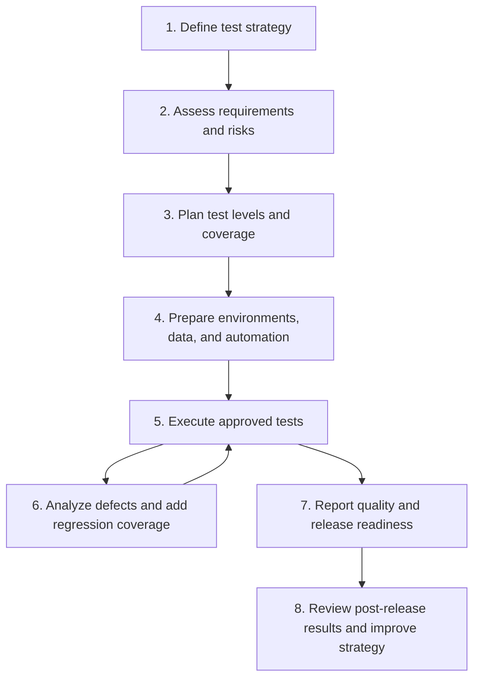
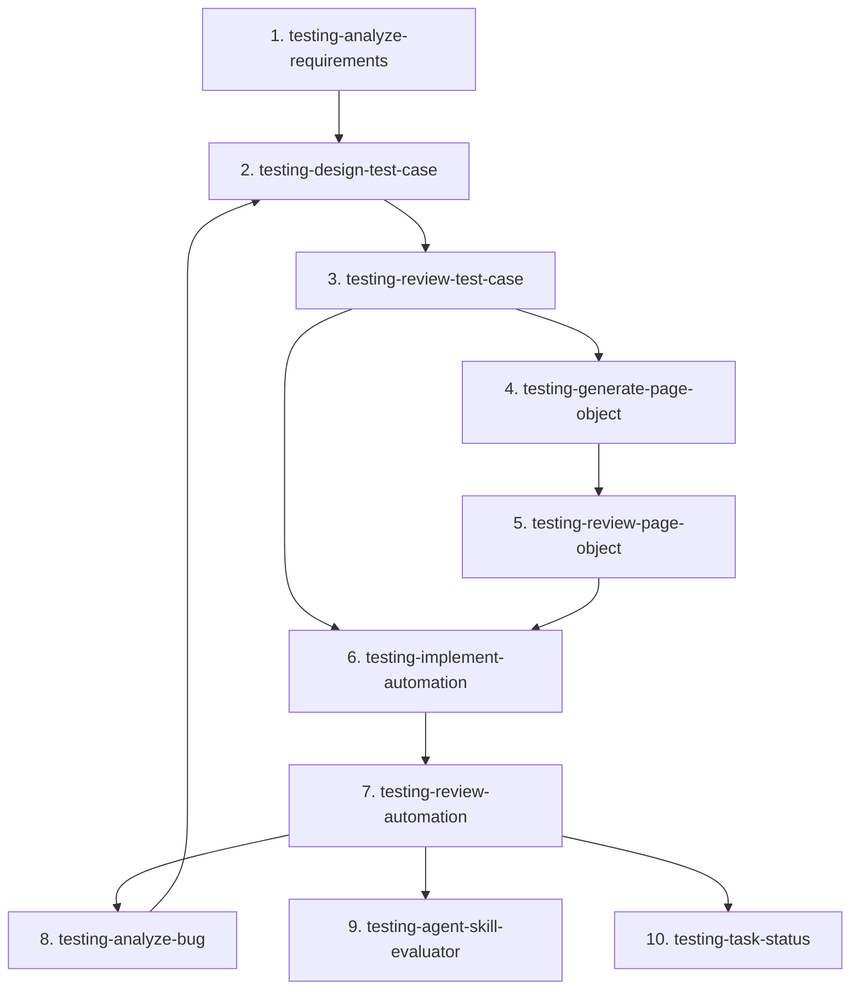

# Test Agent — Getting Started Guideline


**IMPORTANT: THE AGENTS AND SKILLS IN THIS REPOSITORY ARE PRACTICAL STARTING POINTS, NOT STANDARDIZED RULES; REVIEW AND REVISE THEM TO FIT YOUR PROJECT'S PURPOSE BEFORE USE.**

---
A step-by-step guide for new users to run the **Test Agent** end to end, following its Preferred Skill Flow.

- Agent definition: [.github/agents/test.agent.md](../../.github/agents/test.agent.md)
- Automation conventions: [instructions/testing/copilot-instructions.md](copilot-instructions.md)
- Prompt library: [prompts/testing prompts.md](../../prompts/testing%20prompts.md)
- Skills: [.github/skills/](../../.github/skills/)

---

## 1. Before you start

 - If you use GitHub Copilot, put your custom agents in `.github/agents/` before using them.
 - If you use GitHub Copilot, put your selected skills in `.github/skills/` so Copilot can find and use them.

### 1.1 Select the agent
In VS Code Copilot Chat, switch the chat mode to **Test Agent**. All examples below assume the Test Agent is active.

### 1.2 Prepare your inputs
| Input | Needed for | Notes |
|---|---|---|
| Requirement / user story file | Steps 1–2 | One file per requirement, with acceptance criteria |
| Business context | Steps 1–2 | Feature objective, scope, priority/risk |
| Test cases (generated) | Steps 3–6 | Produced by step 2 |
| App URL / DOM / mockups | Step 4 | Needed for reliable locators |
| Existing automation repo | Steps 4–7 | Page objects, fixtures, test data |

### 1.3 Create the working folders

**When the team has agreed on a different project folder structure, use AI to inspect the repository and update each skill's output folder accordingly before generating artifacts.** 

The skills write to conventional folders. Create them once in your project:

```
reports/      # requirement analysis + bug analysis reports
test-cases/   # generated test case documents
reviews/      # review reports and findings
src/pages/    # Playwright page objects
src/components/
tests/        # Playwright specs
```

Sample prompt:

```
Inspect the existing project structure and identify the team's agreed folders for reports, test cases, reviews, page objects, components, and Playwright tests. Use those folders as the output locations for the testing skills. Do not create the conventional folders if equivalent team folders already exist.
```


### 1.4 Rules of engagement
- The agent **stops and asks** when requirements are ambiguous — answer the clarification questions instead of pushing it to guess.
- The agent **generates artifacts, it does not execute tests** unless you explicitly ask and the environment is ready.
- Every step produces a reviewable file. Read it and approve before moving to the next step.

---

## 2. Project-level quality workflow

Use this workflow when starting testing for a new project or product. It provides the high-level path from strategy definition through release and is broader than the user-story implementation flow in section 3.



### 2.1 Test strategy and coverage model

Start with `testing-test-strategy` to define the scope, risks, responsibilities, environments, test data, tools, entry and exit criteria, quality gates, and reporting approach. The strategy should cover the applicable test levels below:

| Test level | Purpose | Typical output |
|---|---|---|
| Unit testing | Verify isolated functions, classes, and components | Unit test plan and coverage targets |
| Integration testing | Verify interactions between modules, services, databases, and external dependencies | Integration test scenarios and contract checks |
| Functional testing | Verify business behavior against requirements and acceptance criteria | Functional test cases and traceability matrix |
| End-to-end testing | Verify critical user journeys across the integrated system | E2E scenarios, automation plan, and execution results |
| Non-functional testing | Verify quality attributes such as performance, accessibility, security, reliability, and usability | NFR scenarios, thresholds, and specialist test reports |

The test pyramid should guide the balance: many fast unit tests, fewer integration and functional tests, and a focused set of end-to-end tests for critical journeys.

### 2.2 Test Agent responsibilities and reports

The Test Agent is responsible for:

- Defining and maintaining the test strategy, scope, risks, test levels, tools, environments, data approach, and quality gates.
- Reviewing requirements for completeness and testability, then identifying ambiguities that need clarification.
- Designing traceable test cases for unit, integration, functional, end-to-end, and applicable non-functional coverage.
- Creating or reviewing page objects, fixtures, test data, and automation implementation plans for the agreed framework.
- Executing tests only when explicitly requested and the environment is ready; otherwise, producing execution instructions and expected evidence.
- Analyzing failures and defects, identifying likely root-cause areas, and ensuring confirmed defects receive regression coverage.
- Coordinating or handing off specialist performance, security, and accessibility testing when the required tooling or expertise is outside the Test Agent's available skills.
- Producing evidence-based quality and release-readiness recommendations without claiming a pass when required evidence is missing.

Recommended project-level artifacts are:

- `reports/Test-Strategy-<project>.md` — scope, risks, test levels, responsibilities, environments, data, tools, and quality gates.
- `reports/Requirements-Testability-<project>.md` — requirement gaps, assumptions, and clarification decisions.
- `test-cases/Traceability-Matrix-<project>.md` — requirements mapped to test cases across all applicable test levels.
- `reports/Test-Execution-<cycle>.md` — executed scope, environment, results, failures, evidence, and known limitations.
- `reports/Quality-Gate-<release>.md` — coverage, defect status, non-functional results, risks, and release recommendation.

Use a project-level prompt such as:

```
Create a project-wide test strategy for <project>. Cover unit, integration, functional, end-to-end, and non-functional testing, including accessibility, security, and performance where applicable. Define scope, risks, responsibilities, environments, test data, tools, entry and exit criteria, quality gates, required reports, and the evidence needed for a release-readiness decision. Inspect the existing project structure and use the team's agreed output folders.
```

## 3. User-story implementation workflow



Steps 1–3 are the **design track**. Steps 4–7 are the **automation track**. Steps 8–10 are **on demand**.

---

## 3. How to use a skill

1. **Choose the skill** that matches your task from the flow above or the [.github/skills catalog](../../.github/skills/).
2. **Add the skill to your project** by copying its folder into `.github/skills/`. Keep the `SKILL.md` file and any referenced assets or references together.
3. **Open Copilot Chat**, switch to **Test Agent**, and invoke the skill with `/skill <skill-name>`.
4. **Provide the required inputs**: file paths, scope, business context, existing code, and any relevant evidence.
5. **Review the generated artifact** in the expected output folder before starting the next step.

Example:

```
/skill testing-analyze-requirements
Analyze: requirements/US-001-customer-login.md
Business context: returning customer authentication for the storefront
Output: reports/Report-Requirements-Analysis-US-001.md
```

The Test Agent follows the skill's instructions and produces the documented artifact. If the skill asks clarification questions, answer them before continuing. Do not skip to the next skill while blocking findings or required inputs remain unresolved.

---

## 4. Step-by-step

### Step 1 — Analyze requirements (`testing-analyze-requirements`)
**Goal:** confirm the requirement is complete, consistent, and testable *before* writing any test case.

```
Analyze requirement: US-001 Customer Login
Source: requirements/US-001-customer-login.md
Business context: returning customer authentication for the storefront
Artifacts: Figma login screen, auth API contract v2
```

**Outputs**
- `reports/Report-Requirements-Analysis-US-001.md`
- `reports/Findings-Requirements-Analysis-US-001.md`

**Exit criteria:** all blocking gaps/ambiguities are answered or explicitly logged as assumptions. Do not continue with unresolved blockers.

---

### Step 2 — Design test cases (`testing-design-test-case`)
**Goal:** produce risk-based, traceable test cases covering happy path, negative path, boundary, and edge scenarios.

```
Design test cases for: US-001 Customer Login
Input: requirements/US-001-customer-login.md
Scope: both
```

`Scope` accepts `functional`, `non-functional`, or `both`. Use `both` when accessibility, security, or performance criteria are in the story.

**Output**
- `test-cases/TC-US-001-Customer-Login.md`

**Exit criteria:** every acceptance criterion maps to at least one test case ID.

---

### Step 3 — Review test cases (`testing-review-test-case`)
**Goal:** independent quality gate on coverage, correctness, and standards compliance.

```
Review test cases: test-cases/TC-US-001-Customer-Login.md
Scope: both
Requirements: requirements/US-001-customer-login.md
Risk context: login is a critical journey, high business impact
```

**Outputs**
- `reviews/Report-Review-Test-Case-TC-US-001-Customer-Login.md`
- `reviews/Findings-Review-Test-Case-TC-US-001-Customer-Login.md`

**Exit criteria:** no open critical/high findings. Loop back to Step 2 to fix, then re-review. Test cases are now **approved** and can drive automation.

---

### Step 4 — Generate page objects (`testing-generate-page-object`)
**Goal:** build the reusable UI layer first, so specs stay thin.

```
Generate page objects for: customer login flow
Context: test-cases/TC-US-001-Customer-Login.md
Existing code: src/pages/LoginPage.ts
UI evidence: https://app.example.com/login DOM snapshot
```

**Outputs**
- `src/pages/LoginPage.ts`
- `src/components/<ComponentName>.ts` (when shared UI is involved)

**Rules enforced** (see [copilot-instructions.md](copilot-instructions.md)): one class per page, locators declared in the constructor, unique and robust selectors, no raw `page` usage leaking into tests.

---

### Step 5 — Review page objects (`testing-review-page-object`)
**Goal:** catch fragile locators and POM violations before they multiply across specs.

```
Review page object scope: login page model
Input files: src/pages/LoginPage.ts, src/components/Header.ts
References: test-cases/TC-US-001-Customer-Login.md
```

**Outputs**
- `reviews/Report-Review-Page-Object-login-page-model.md`
- `reviews/Findings-Review-Page-Object-login-page-model.md`

**Exit criteria:** no brittle/index-based locators, no duplicated components, method names express user intent.

---

### Step 6 — Implement automation (`testing-implement-automation`)
**Goal:** turn approved test cases into Playwright specs that reuse the reviewed page objects.

```
Implement automation for: customer login flow
Test cases: test-cases/TC-US-001-Customer-Login.md
Data: src/test-data/login-data.ts
```

**Outputs**
- `tests/US-001-Customer-Login.spec.ts`
- `tests/US-001-Customer-Login-api.spec.ts` (when API coverage applies)

**Exit criteria:** each spec references its test case ID, tests are order-independent, no hard waits, data-driven where inputs vary.

---

### Step 7 — Review automation (`testing-review-automation`)
**Goal:** final quality gate before merge.

```
Review automation scope: PR-278 login tests
Input files: tests/US-001-Customer-Login.spec.ts
Traceability refs: test-cases/TC-US-001-Customer-Login.md
Evidence: flaky-run-report.md
```

**Outputs**
- `reviews/Report-Review-Automation-PR-278.md`
- `reviews/Findings-Review-Automation-PR-278.md`

**Exit criteria:** assertions are meaningful, traceability is explicit, no flakiness patterns, standards checklist passes.

---

### Step 8 — Analyze bugs (`testing-analyze-bug`) — as needed
Use whenever a test fails or a defect is reported.

```
Analyze bug: BUG-145 Login fails for SSO users
Context: staging build 2026.08.10, auth module
Expected: SSO user is redirected to dashboard
Actual: user is returned to login page with no error
Evidence: auth-log.txt, screenshot.png, trace.zip
```

**Outputs**
- `reports/Report-Bug-Analysis-BUG-145.md`
- `reports/Findings-Bug-Analysis-BUG-145.md`

**Follow-up (mandatory):** every confirmed defect gets regression coverage — return to Step 2 to add the test case, then re-run Steps 3, 6, 7.

---

### Step 9 — Evaluate skill quality (`testing-agent-skill-evaluator`) — optional
For maintainers benchmarking the skills themselves.

```
Use the agent-skill-evaluator skill to evaluate the testing-design-test-case skill.
Target skill: skills/testing-design-test-case
Evaluation file: skills/testing-agent-skill-evaluator/references/evals/evals-testing-design-test-case.json
Output workspace: working-artifacts/evals/
```

**Outputs:** `evaluation-results.json`, `grading.json`, `timing.json`, `benchmark.json`, `feedback.json`.

### Step 10 — Report testing status (`testing-task-status`) — optional
**Goal:** collect testing artifacts and Playwright results into a portfolio status report.

```
Generate a testing task status report
Input root: working-artifacts/
Include: requirements, test cases, scripts, manual results, Playwright results, and test runs
Summary basis: latest-run or all-runs
```

**Output:** `working-artifacts/testing-status/Test-Status-<YYYYMMDD-HHmmss>.md`

**Exit criteria:** every available artifact is inspected, each discovered test run has a status record, totals reconcile, and missing evidence is marked `Not Available`.

---

## 5. Release readiness checklist

Before declaring the feature quality-complete, confirm:

- [ ] Requirement analysis report exists with no unresolved blockers
- [ ] Every acceptance criterion traces to a test case ID
- [ ] Test case review has no open critical/high findings
- [ ] Page objects reviewed and POM-compliant
- [ ] Automation implemented for the agreed scope and reviewed
- [ ] Accessibility checks completed for critical journeys (WCAG 2.1 AA)
- [ ] No unresolved critical/high security findings, or risk acceptance recorded
- [ ] All confirmed defects have regression coverage
- [ ] Assumptions and risks documented

Critical accessibility or security failures on key flows **block release** until fixed or formally risk-accepted.

---

## 5. Quick reference

| # | Skill | Trigger | Output folder |
|---|---|---|---|
| 1 | `testing-analyze-requirements` | `Analyze requirement:` | `reports/` |
| 2 | `testing-design-test-case` | `Design test cases for:` | `test-cases/` |
| 3 | `testing-review-test-case` | `Review test cases:` | `reviews/` |
| 4 | `testing-generate-page-object` | `Generate page objects for:` | `src/pages/`, `src/components/` |
| 5 | `testing-review-page-object` | `Review page object scope:` | `reviews/` |
| 6 | `testing-implement-automation` | `Implement automation for:` | `tests/` |
| 7 | `testing-review-automation` | `Review automation scope:` | `reviews/` |
| 8 | `testing-analyze-bug` | `Analyze bug:` | `reports/` |
| 9 | `testing-agent-skill-evaluator` | `Use the agent-skill-evaluator skill…` | chosen output workspace |
| 10 | `testing-task-status` — optional | `Generate a testing task status report` | `working-artifacts/testing-status/` |

---

## 6. Troubleshooting

| Symptom | Cause | Fix |
|---|---|---|
| Agent asks many clarification questions | Requirement lacks acceptance criteria | Complete Step 1 and answer the findings log before Step 2 |
| Test cases feel generic | Requirement content was summarized, not supplied | Pass the file path, not a paraphrase |
| Page objects use fragile locators | No UI evidence provided | Re-run Step 4 with a URL or DOM snapshot |
| Specs duplicate locator logic | Step 4 skipped | Generate and review page objects first, then re-run Step 6 |
| Agent claims tests "executed" | Not expected behavior | Execution only happens when explicitly requested and the environment is ready; otherwise expect artifacts plus run instructions |
| Output lands in the wrong folder | Folders missing | Create the folder structure in section 1.3 |
